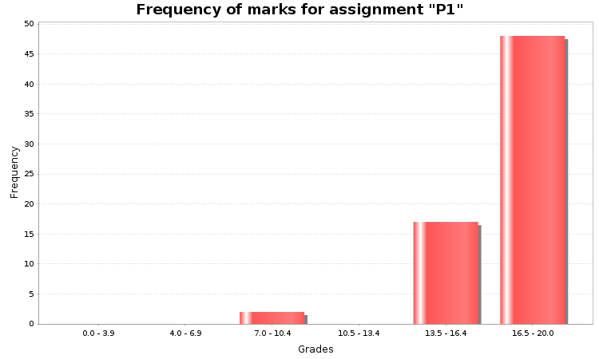

# Seminar Presentation 1

## Feedback from Miriam Bowen (Mark: 15)

| Categories and Questions of evaluation: | Good or Very Good (16.5-20) | Fair to Good (11-16.4) | Poor (7-11) | Unacceptable (<7) |
| --- | --- | --- | --- | --- |
| **Clarity with which the text is presented (40%):** Has the structure of the text become clear? Have the presenters identified what the paper is aiming to establish, its key claims and the moves made in progressing its argument? | A clear outline at the start and you did a good job of signposting topics throughout the talk.  There were some interesting considerations about the philosophical implications of the view covered in the later half of the presentation. | Would have been helpful to have some key terms defined near the start or on the handout for the audience to refer back to. |  |  |
| **Critical engagement (40%):** Have the presenters analysed, rather than merely described the texts? Have they highlighted problems, offered potential solutions/counter-claims, etc.? Have the presenters offered their own thoughts on the problems, and suggested 2 or more items of further reading? | In the first part of the presentation, the breakdown of the arguments into premise conclusion form was good. I thought you did a good job of explaining where the assumptions in the arguments were made.  The comparison of logical structure between conspiracy theory and imposter syndrome views was really interesting.  There was the start of some good critical engagement in the later part of the presentation with considerations of how we might use the epistemic similarities between conspiracy theories and imposter syndrome to draw out further philosophical arguments – the implications of the view could have been drawn out a bit further. | In the logical argument breakdown, I was unclear on the argument structure in argument 2 of the imposter syndrome case.  While I could see the way that the arguments could be applied to form critical engagement of the paper a bit more work could have been done drawing this out for the audience to follow the thread of this argument. |  |  |
| **Delivery of presentation (20%):** Does the presentation keep to time? Are visual aids effective and used appropriately? Does the presentation invite wider class discussion? Are presenters articulate and clear, and can they respond to questions? |  | The handout could have been out to better use.  A more even split of talking in the Q and A would have been good as well. | The split of talking between the two of you could have been done a lot better. There were some really interesting points brought up at the very end of the presentation that brought in more of the philosophical implications form the paper that Hawley talks about that were rushed due to poor timing across the presentation. |  |

The presentation felt a bit disjointed this week. While it's fine to work on different aspects of the argument and divide the work in that way a bit more work on integrating the different parts of the presentation and drawing on each others work would have really helped the presentation be more cohesive.  I thought the logical analysis was a nice touch and was explained well – however it did take up a lot of time and meant that you didn't have sufficient time in the presentation to explore or develop some of the other parts of the paper in sufficient detail. I thought there were some really interesting points brought up at the end that led nicely into the Q and A and class discussion and it was a shame this was a bit rushed.

## [Slides](https://minghongx.github.io/graduate-diploma-in-philosophy/reading-philosophy-week7/) & [Handout](./presentation1-handout.pdf)

## Transcript

The author begins this essay by discussing how conspiracy theories should be defined. One approach is to define them based on their distinctive content, but this method doesn't clarify whether the term is neutral or negative. To understand this would require impractical efforts. Therefore, the author proposes an alternative: still using the distinctive content, but directly defining conspiracy theories as a negative term, because this negativity aligns more closely with everyday usage. The author claims that if the definition mirrors ordinary usage closer, then it's easier to use it in the political and practical debates which in return generates feedback to motivate philosophical work in this area. Thus, the author implies that it's preferred to just define the term to be pejorative, instead of to investigate whether it's truly pejorative.

But in today's presentation, I will investigate this question a little further by using the first-order predicate logic I just started learning two days ago.

As being proposed, we can define term by its distinctive content. What distinctive content do conspiracy theories have? The author presents six significant phenomena from two perspectives. The second perspective answers why conspiracy theories are appealing to people. Roughly speaking, it makes you feel certain, feel safer, feel more high status.

We will focus on the epistemological perspective. Next, I will explain these three significant phenomena Selective Cynicism, Gullibility, and Prejudice by analysing two arguments from conspiracy theorists,

so as to argue that conspiracy theories are epistemically unjustified.

Let's formulate the first premise of Argument 1 from the conspiracy theorists into the language of first-order predicate logic. If there is a successful cover-up, then both this will be difficult to detect, and occasional anomalies will have heightened epistemic significance. The second premise means that there is a successful cover-up. We conclude that occasional anomalies have heightened epistemic significance. There are two epistemic issues associated with the first argument. Firstly, the second premise is not motivated; it's just a belief. In most cases, we cannot know whether acts of covering up the truth have occurred unless, for example, we have access to official databases, or the process is transparent enough. Most of the time, we can only question the existence of such acts, but conspiracy theorists take it as a priori or as a given. They have an abnormal strong belief that this is the case. The second issue is, even if the second premise is motivated so that we get the conclusion, conspiracy theorists equate heightened epistemic significance with trustworthiness and think these anomalies reflect the truth.

Move on to the second argument. We formulate the first premise as follows: If some official sources of information have been co-opted to assist with covering up the truth, then all of them are not trustworthy. I believe this is an overgeneralisation. The existence of examples doesn't necessarily reflect the overall situation.

We can incorporate the phenomena identified in the above analysis into the perspective provided by the author. Conspiracy theorists are selective cynicism. They have abnormally strong belief in 'There is successful cover-up'. They trust in their own capacities to perceive conspiracy. Conspiracy theorists are gullible. Occasional anomalies have heightened epistemic significance does not entail the anomalies are trustworthy. However, conspiracy theorists have exaggerated trust in them. Conspiracy theorists are prejudiced. They distrust all the official sources, but this seems to be a faulty generalisation. A better attitude could be: If some official sources of information have been co-opted to assist with covering up the truth, then these sources are not trustworthy.

Let's go back to our initial question: whether conspiracy theorises is truly pejorative term. According to my investigation, the answer is yes, it is pejorative, and more specifically, it's epistemically unjustified.

If those shoddy epistemic practices are corrected, then conspiracy theories could be considered as hypotheses.

The author argues that imposter syndrome and conspiracy theories share similarities in epistemology, or more specifically, in patterns of trust. I will demonstrate this similarity by analysing two arguments from imposter syndrome sufferers.

The structure of the first argument of imposter syndrome is same as the first argument of conspiracy theories. However, when we contextualise this structure within the realm of imposter syndrome, there are differences. For instance, in conspiracy theories, a cover-up is a knowingly act, whereas in imposter syndrome, it could be either knowingly or unknowingly. Knowingly and unknowingly is a tautology and doesn't impact the structure, so we can disregard it. One major difference between imposter syndrome and conspiracy theories lies in premise 2. In conspiracy theories, premise 2 is unjustified, but in the context of imposter syndrome, it is often justified because we can find plenty of examples.

Argument 2 is different in general, but the conclusion is similar to that of conspiracy theories.

Using myself as an example, I believe I don't deserve my Bachelor's degree in Engineering because I have my own set of standards in mind. I think that as an engineering graduate, one should possess certain qualities upon graduation. I don't have them, so I feel I don't deserve the degree. This is a psychological reason. My set of standards originates from my family. My father is an engineer, and so is my brother. They serve as role models, leading me to formulate such standards. This is an environmental reason. So, in the context of impostor syndrome, we have more resources to inference. According to the essay, impostor syndrome has environmental reasons and psychological reasons. From them we deduce a conclusion to reject certain positive feedback, such as my degree certification. You can feel that, overall, the thinking pattern of impostor syndrome is more rational than conspiracy theories ...... but still seems unjustified.

We can apply the perspective offered by the author for defining the conspiracy theories to impostor syndrome. Surprising, the impostor syndrome has similar trust pattern. We want to investigate whether imposter syndrome is unjustified, but this perspective presupposes a negative connotation. Therefore, we'll set it aside and analyse the three believes. The first belief can be justified by appealing to first person authority. I claim that the second belief can be justified by exploiting the premises of Argument 2 to proof heightened epistemic significance entail trustworthiness. The third belief can be justified by Argument 2. Thus, it seems that impostor syndrome is justified.

In another essay, the author argues that the beliefs associated with impostor syndrome are often justified. So, the author and I have reached a consensus that impostor syndrome is epistemically justified. Conversely, believing in conspiracy theories is epistemically unjustified; by author's definition, it's unjustified, and my naive investigation confirms this.
